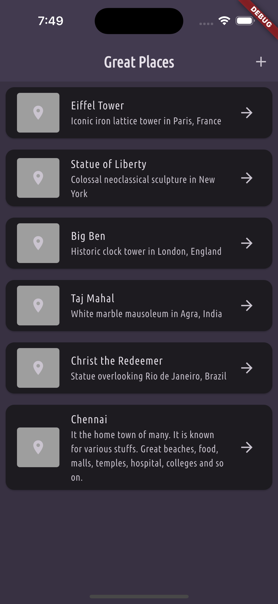

# Favourite Places

A beautiful Flutter app to manage and keep track of your favorite places around the world. Add, view, and delete your favorite locations with an intuitive and user-friendly interface.

## Features

✨ **Core Functionality**

- 📍 **View Places** - Browse a list of all your favorite places with descriptions
- ➕ **Add Places** - Easily add new places with a form that captures place name and description
- 🗑️ **Delete Places** - Swipe left on any place tile to delete it
- ⬅️ **Easy Navigation** - Back buttons for seamless navigation between screens

🎨 **User Interface**

- Dark theme with purple accent color
- Smooth animations and transitions
- Responsive design that works on all screen sizes
- Clear visual feedback for user actions (snack bars, confirmations)

⚡ **Technical Highlights**

- Built with **Flutter** for cross-platform compatibility
- **Riverpod** for state management
- Type-safe and well-structured codebase
- **Google Fonts** (Ubuntu Condensed) for elegant typography

## Screenshots

<div align="center">
  
  
</div>

**Left:** Main page displaying a list of favorite places with swipe-to-delete functionality  
**Right:** Add new place form with place name and description inputs

## Project Structure

```
lib/
├── main.dart                 # App entry point and theme configuration
├── models/
│   └── place.dart           # Place data model
├── providers/
│   └── places_provider.dart # Riverpod provider for places state management
└── widgets/
    ├── places_list.dart     # Main list page with swipe-to-delete
    └── add_place.dart       # Form page for adding new places
```

## Getting Started

### Prerequisites

- Flutter SDK (3.9.2 or higher)
- Dart (included with Flutter)

### Installation

1. **Clone the repository**

   ```bash
   git clone <repository-url>
   cd favourite_places
   ```

2. **Install dependencies**

   ```bash
   flutter pub get
   ```

3. **Run the app**
   ```bash
   flutter run
   ```

## Dependencies

- **flutter_riverpod** (^3.2.0) - State management
- **google_fonts** (^8.0.0) - Beautiful typography
- **state_notifier** (^1.0.0) - State management utilities

## Usage

### Adding a Place

1. Tap the **+** button in the top-right corner
2. Enter the place name and description
3. Tap **Save Place** to add it to your collection

### Deleting a Place

1. Swipe a place tile from right to left
2. The red delete background will appear with a trash icon
3. Release to delete the place

### Viewing Places

- Browse all your places on the main screen
- See place name, description, and a location icon for each entry

## Theme

The app features a custom dark theme with:

- **Primary Color** - Purple (#660FF7)
- **Background** - Dark grey (#383142)
- **Typography** - Ubuntu Condensed font for a modern look

## Future Enhancements

- 📷 Add photos to places
- 📍 Integration with maps API
- ⭐ Rate and favorite places
- 🔍 Search and filter functionality
- 💾 Persistent storage with local database
- ☁️ Cloud synchronization

## Contributing

Feel free to fork this project and submit pull requests for any improvements.

## License

This project is open source and available under the MIT License.

---

**Built with ❤️ using Flutter**
